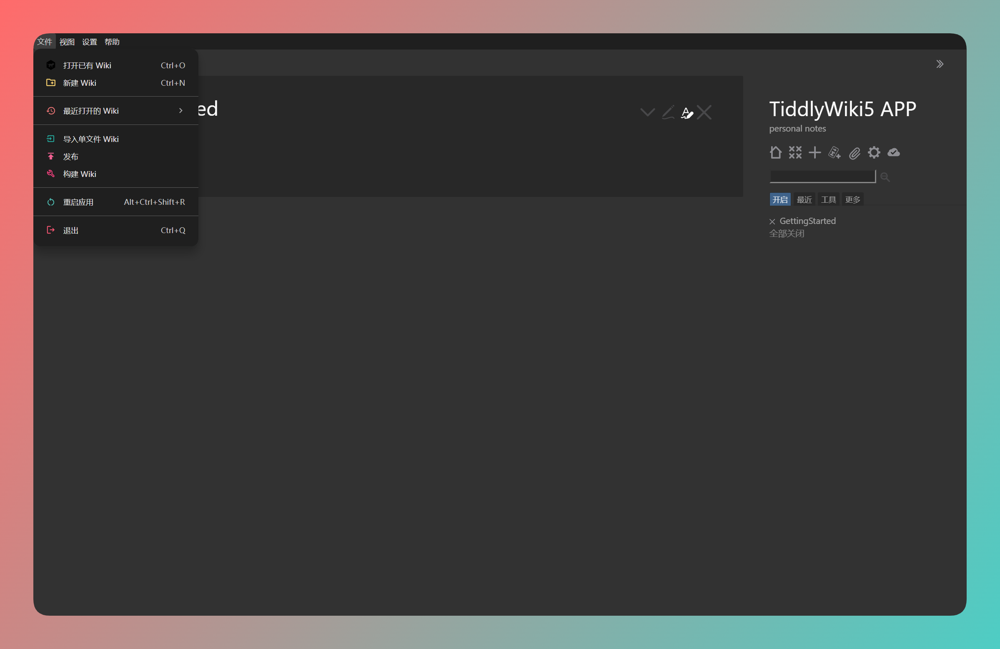
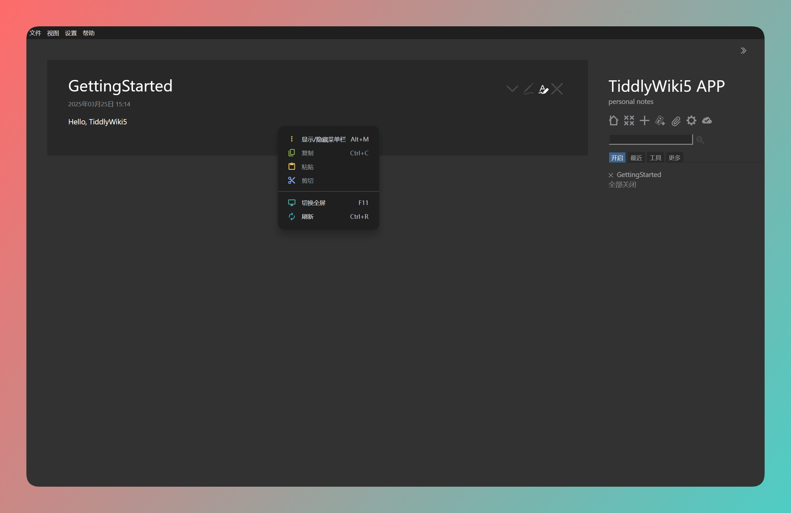

# TiddlyWiki App 🌟




一个 TiddlyWiki 桌面应用，提供更加丝滑的桌面端使用体验。

## ✨ 功能特点

- 🔧 系统托盘支持，最小化到托盘
- 📂 支持模板导入, 单文件导入
- 🚀 支持多种启动方式：
  - 💻 本地服务器模式
  - 🌐 浏览器打开
- 📄 支持子Wiki
- 📝 Wiki 管理功能：
  - 📂 打开/切换 Wiki
  - 🔨 构建静态 Wiki
  - 📁 在系统文件管理器中打开
  - 🚀 一键部署到 GitHub Pages
- 🌍 国际化支持
  - 🇨🇳 简体中文
  - 🇺🇸 English
- 🔄 自动更新功能

## 📖 使用说明

### 🔰 安装

下载并安装最新版本的应用。

* Manjaro 系列：`pacman -S appimagelauncher and use appimage install, or use pacman package`
* Windows: 下载 exe 即可
* Macos: 下载 dmg 安装包（未测试）

### ⚡ 基本操作

1. 使用菜单栏或系统托盘进行操作：
   - 📋 文件菜单：
     - 📂 打开 Wiki：选择其他 Wiki 文件夹
     - 🔨 构建 Wiki：生成静态 HTML 文件
     - 🌐 在浏览器中打开：使用默认浏览器打开当前 Wiki
     - 📁 打开当前 Wiki 文件夹：在文件管理器中查看
   - 🔽 系统托盘：
     - 🖱️ 左键点击：切换窗口显示/隐藏
     - 📌 右键菜单：快速访问常用功能

### ⌨️ 快捷操作

- 🔽 最小化：窗口会自动隐藏到系统托盘
- ❌ 关闭按钮：默认最小化到托盘，可通过托盘菜单完全退出

## 👨‍💻 开发

### 🛠️ 环境要求

- 📦 Node.js
- 📦 npm 或 yarn
- 📦 git

### 🚀 本地开发

```bash
# 安装依赖
npm install

# 启动开发服务
npm run dev
```

## 🤔 Why create Tiddlywiki APP?

首先是解决 TiddlyWiki 长期困扰用户的保存问题。尽管社区已经提供了许多解决方案，但还有什么方法能比直接下载 exe 软件，双击安装来得更简单、更方便呢？

其次，Tiddlywiki APP 和类似应用的主要区别在于，它完全不侵入用户的 Wiki，也不会对其进行任何改动，真正意义上的开箱即用。我希望它尽可能简单，让初次尝试 TiddlyWiki 的用户无需额外学习其他知识。

关于空白版本，我希望用户在初次接触 TiddlyWiki 时，能够体验到 100% 纯正的原始 TiddlyWiki，而不是被各种插件包围，导致困惑不已。这也许就是 Jermolene 选择提供空白版本作为用户入门体验 TiddlyWIki 的初衷吧。

至于“空白版本可能吓跑新用户”的说法，这里不作过多讨论。我希望更多人了解 TiddlyWiki，但不会刻意推广它。毕竟，就当前而言，TiddlyWiki 的易用性并没有太大的推广优势。