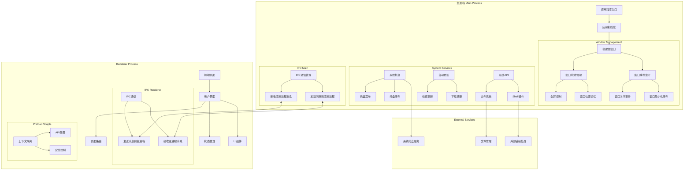

# TiddlyWiki App 🌟

[简体中文](./README.zh-CN.md) | English


A TiddlyWiki desktop application that provides a smoother desktop experience.

## ✨ Features

- 🔧 System tray support, minimize to tray
- 📂 Template import and single file import support
- 📂 Markdown batch import support
- 🔒 Encrypted HTML build support
- 🚀 Multiple startup modes:
  - 💻 Local server mode
  - 🌐 Browser opening
- 📄 Sub-Wiki support
- 📝 Wiki management features:
  - 📂 Open/switch Wiki
  - 🔨 Build static Wiki
  - 📁 Open in system file manager
  - 🚀 One-click deploy to GitHub Pages
- 🌍 Internationalization support
  - 🇨🇳 Simplified Chinese
  - 🇺🇸 English
- 🔄 Auto-update functionality

## 📖 Usage Guide

### 🔰 Installation

[Download tiddlywiki-app](https://github.com/oeyoews/tiddlywiki-app/releases)

> For arch(or manjaro) user, you can install `pacman -U tiddlywiki-app-*.pacman`, or use PKGBUILD directly

<!-- * Manjaro Series: `pacman -S appimagelauncher and use appimage install, or use pacman package`
* Windows: Download the exe file
* macOS: Download the dmg installer (untested) -->

### ⚡ Basic Operations

1. Use the menu bar or system tray:
   - 📋 File menu:
     - 📂 Open Wiki: Select other Wiki folders
     - 🔨 Build Wiki: Generate static HTML files
     - 🌐 Open in browser: Open current Wiki in default browser
     - 📁 Open current Wiki folder: View in file manager
   - 🔽 System tray:
     - 🖱️ Left click: Toggle window show/hide
     - 📌 Right-click menu: Quick access to common features

### ⌨️ Shortcuts

- 🔽 Minimize: Window automatically hides to system tray
- ❌ Close button: Defaults to minimize to tray, can fully exit via tray menu

## 👨‍💻 Development

### 🛠️ Requirements

- 📦 Node.js
- 📦 npm or yarn
- 📦 git

### 🚀 Local Development



```bash
# Install dependencies
npm install

# Start development server
npm run dev
```

## 🤔 Why create Tiddlywiki APP?

The primary goal is to solve TiddlyWiki's long-standing save issues. While the community has provided many solutions, what could be simpler than downloading and installing an exe file?

Secondly, what sets Tiddlywiki APP apart is that it doesn't interfere with users' Wikis or make any modifications - truly plug-and-play. I want it to be as simple as possible, allowing first-time TiddlyWiki users to start without learning additional concepts.

Regarding the blank version, I want users to experience 100% pure TiddlyWiki when first encountering it, rather than being overwhelmed by plugins. This might be why Jermolene chose to provide a blank version for users' initial TiddlyWiki experience.

As for concerns about "blank versions scaring away new users," I won't discuss that much here. While I hope more people learn about TiddlyWiki, I won't actively promote it, as currently, TiddlyWiki's ease of use doesn't offer significant promotional advantages.

<!-- "tiddlywiki": "npm:@oeyoews/tiddlywiki-lite@5.3.6-lite-20250402" -->

<!-- patch -->
<!-- pnpm patch tw5-typed -->

## 📚 Related Projects

* [UseWiki2](https://github.com/oeyoews/usewiki2)
